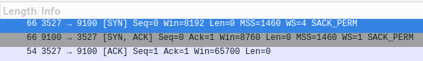

# Network Design Final Project

Cade Thornton

11/13/2023

ENCE 3321

## Table of Contents

-------

+ [Introduction](#Introduction )
+ [Inconsistent_Printer](#Inconsistent_Printer)
    * [Problem Scope](#ProblemScope)
    * [Problems](#Problems)
+ [Stranded_in_a_Branch_Office](#Stranded_in_a_Branch_Office)
    * [Problem Scope](#ProblemScope)
    * [Problems](#Problems)
+ [Ticked_off_Developer](#Ticked_off_Developer)
    * [Problem Scope](#ProblemScope)
    * [Problems](#Problems)
+ [Conclusion](#Conclusion)

## Introduction 

-------

## Inconsistent_Printer

### Problem Scope

Our IT help desk administrator is having trouble resolving a printing issue. Users in
the sales department are reporting that the high-volume sales printer is
malfunctioning. When a user sends a large print job to the printer, it will print
several pages and then stop printing before the job is done. Multiple driver
configuration changes have been attempted but have been unsuccessful. The help
desk staff would like you to ensure that this isn’t a network problem

### Problems

- What protocol is being used between the printer and the user?
    - the only protocol being used is TCP
    

    
    

- What is the printer IP address?
    - The printer IP address is 172.16.0.253 as seen by the capture below

    

    
    

    

- Which port is the server app at the printer listening at?
    - the screenshot clearly indicates the server app is listening at the desination port 9100

    

    
    

    

- Is the protocol handshake being done properly?
    - The handshake is being done properly because there is a (SYN, SYN-ACK, ACK) between the client and server as shown in the packets below

    

    
    

- At which packet number do you see a sign of trouble?
    - At packet 120, there is a "[TCP Window Full]" indicator, which suggests that the receiving end's buffer (the printer, in this context) is full and cannot accept any more data at the moment. This could indicate that the printer is unable to process the incoming data quickly enough, which can be a sign of the printer's performance issues.

- How many attempts are done by the client side to retransmit the lost packet?
    - as seen below, the client makes two attempts to retransmit the lost packet

    

    
    

- How long is the retransmission timeout (RTO)?

    RTO = 20.619620 seconds (first retransmission) - 15.117035 seconds (original packet)
    RTO = 5.502585 seconds

    so the Retransmission Timeout (RTO) in this case is approximately 5.5 seconds

- Provide a block diagram for this network and include as much relevant
information as you can in it'

    
    

- Do you think this is a network issue or printer issue? Support your choice with reasonable arguments

    - The Wireshark capture shows that the printer's TCP window becomes full, which suggests that the printer is not processing incoming data fast enough. This could be because the printer's internal buffer is full and it's unable to handle more incoming data, indicating a potential issue with the printer itself rather than the network.

------

## Stranded_in_a_Branch_Office

### Problem Scope

In this scenario, we have a company with a central headquarters and newly
deployed remote branch offices. The company’s IT infrastructure is mostly
contained within the central office using a Windows server-based domain and a secondary domain controller. The domain controller is responsible for handling DNS and authentication requests for users at the branch office.

The domain controller is a secondary DNS server that should receive its
resource record information from the upstream DNS servers at the corporate
headquarters.

- What protocol is being used between the workstation and the Branch server?
    - The protocol in use for the communication between the workstation (source IP 172.16.16.101) and the Branch DNS server (destination IP 172.16.16.251) is DNS (Domain Name System) and UDP

    

    
    

- Which port is the Branch server listening at?
    - The branch server is listening on port 53, which is the tipical port in which DNS operates
- What type of failure was detected on the pcap file from the workstation side?

    - The workstation side is recieving a server failure to resolve the DNS query as shown in the above screenshot

- What type of failure was detected on the pcap file from the Branch side?
    - There is no SYN-ACK received from the branch side, which prevents a TCP connection from being established, as shown below:

    
    

- In which cases does DNS use the TCP protocol?
    - DNS uses the TCP protocol in DNS queries where the server is unable to resolve a query.

- Where do you think the problem is in the network? Do you think this is a
network issue, Branch server issue or workstation issue? Support your choice
with reasonable arguments.
    - I think this is a network issue in that the workstation is not setup to receive TCP connections. If the work station was setup correctly, it could send a SYN-ACK and establish a TCP conneciton, but it does not do so

-------

## Ticked_off_Developer

### Problem Scope

Some of the most frequent arguments in IT are between developers and system
administrators. Developers always blame shoddy network setup and malfunctioning equipment for program malfunctions. System administrators tend to blame bad code for network errors and slow communication.
In this scenario, a programmer has developed an application for tracking the sales at multiple stores and reporting back to a central database. In an effort to save bandwidth during normal business hours, this is not a real-time application. Reporting data is accumulated throughout the day and is transmitted at night as a comma-separated value (CSV) file to be inserted into the central database.
This newly developed application is not functioning correctly. The files sent from the stores are being received by the server, but the data being inserted into the database is not correct. Sections are missing, data is in the wrong place, and some portions of the data are missing. Much to the dismay of the system administrator, the programmer blames the network for the issue. He is convinced that the files are becoming corrupted while in transit from the stores to the central data repository.Your goal is to clarify this situation and conclude if it is a network issue or not.

- What protocol is being used between the central base and the application?
    - The protocol being used is FTP (file transfer protocol), as seen below where a TCP connection is established and then the FTP protocol is being used:

    
    

- What is the central base IP address?
    - The central base IP address, which appears to be the destination for the file upload, is 172.16.16.128.

    

    
    

- Which port is the central base server app listening at?
    - The central base server app is listening on the standard FTP port, which is 21, as seen in the below capture of packet 4:

    

    
    

- At which packet number is the file store request happen?
    - The file store request to upload the CSV file appears to happen at packet number 64, where the FTP command STOR store4829-03222010.csv is issued.

 

    
    

- Was the file transferred fully?
    - packet 88 indicates the file was transferred fully with the correct response for FTP:

    

    
    

- Show the contents of the file captured by Wireshark. Does it look correct?
    - judging by the ordering of the contents with commas, the file looks correct:

    
    

- Provide a block diagram for this network and include as much relevant
information as you can in it
    
    

    
    

- Do you think this is a network issue or code issue? Support your choice with reasonable arguments.
    - Because the contents of the csv files look completley fine, I believe this is a networking issue, specifically in that there are random TCP connections attempting to be established in between each file as seen below:

    

    
    

